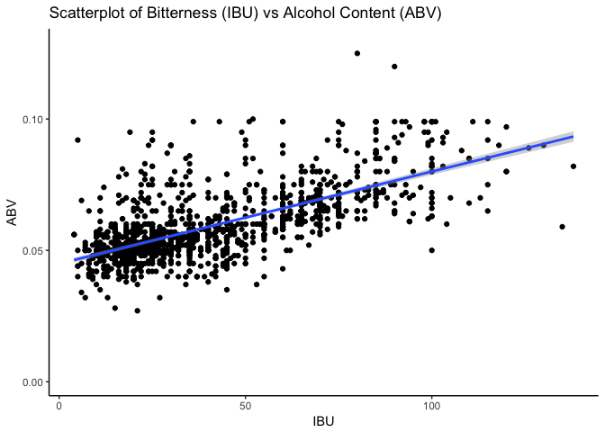

# Beer Analysis
Bradley Robinson, William Gonzalez  
Due: October 23, 2017  


```r
knitr::opts_chunk$set(echo = TRUE)
##library(tidyverse)
library(ggplot2)
```

### Introduction (Brad)
Introduction text goes here 

### Preparing the data
The first step is to prepare the data to be processed in R by loading and merging the datasets

```r
beers <- read.csv("./Data/Beers.csv")
breweries <- read.csv("./Data/Breweries.csv")
merged<-merge.data.frame(breweries,beers, by.x = "Brew_ID", by.y = "Brewery_id", all)
```

### Questions of Interest
</br>

#### Question 1: How many breweries are present in each state? (Brad)
Answer: (answer here)

###### Code explanation
*** 

#### Question 2: Merge beer data with the breweries data. Print the first 6 observations and the last six observations to check the merged file. (Brad)
NOTE: brad please use the name "merged" since I refer to it on subsequent steps. also you can delete the "merge" statement in the preparing data section (redundant)
Answer: (answer here)

###### Code explanation
*** 

#### Question 3: Report the number of NA's in each column. (William)
Answer: From analyzing the data, it looks like the columns with missing values are AVB (62 missing) and IBU (1005 missing). 

```r
colSums(is.na(merged))
```

```
## Brew_ID  Name.x    City   State  Name.y Beer_ID     ABV     IBU   Style 
##       0       0       0       0       0       0      62    1005       0 
##  Ounces 
##       0
```
###### This piece of code counts the number of NA values of the merged dataframe. 
*** 

#### Question 4: Compute the median alcohol content and international bitterness unit for each state. Plot a bar chart to compare. (Brad)
Answer: (answer here)

###### Code explanation
*** 

#### Question 5: Which state has the maximum alcoholic (ABV) beer? Which state has the most bitter (IBU) beer? (William)
Answer: The state has the maximum alcoholic (ABV) beer is Colorado with an ABV of 0.128.</br> 
The state has the most bitter (IBU) beer is Oregon with an IBU of 138. 

```r
merged$State[which.max(merged$ABV)]
```

```
## [1]  CO
## 51 Levels:  AK  AL  AR  AZ  CA  CO  CT  DC  DE  FL  GA  HI  IA  ID ...  WY
```

```r
max(merged$ABV, na.rm = TRUE)
```

```
## [1] 0.128
```

```r
merged$State[which.max(merged$IBU)]
```

```
## [1]  OR
## 51 Levels:  AK  AL  AR  AZ  CA  CO  CT  DC  DE  FL  GA  HI  IA  ID ...  WY
```

```r
max(merged$IBU, na.rm = TRUE)
```

```
## [1] 138
```
###### The first and third lines of code find the State for the highest ABV and IBU respectively. </br>
###### The second and fourth lines of code find the actual value. </br>
*** 

#### Question 6: Summary statistics for the ABV variable. (Brad)
Answer: (answer here)

###### Code explanation
*** 

#### Question 7: Is there an apparent relationship between the bitterness of the beer and its alcoholic content? Draw a scatter plot. (William)
Answer: Judging from the data, there appears to be a very mild positive linear correlation between the Bitterness (IBU) vs Alcohol Content (ABV). 

```r
ggplot(merged, aes(x=IBU, y=ABV,na.rm=FALSE)) + geom_point() + geom_smooth(method=lm) + labs(title="Scatterplot of Bitterness (IBU) vs Alcohol Content (ABV)") + theme_classic() 
```

```
## Warning: Removed 1005 rows containing non-finite values (stat_smooth).
```

```
## Warning: Removed 1005 rows containing missing values (geom_point).
```

<!-- -->

###### Using function ggplot to find the relationship between the bitterness of the beer and its alcoholic content. The resulting scatterplot shows a very mild positive correlation between those two values.  
*** 

### Conclusion (William)

At the customer request, we analyzed and merged data from two datasets, [Beers.csv](./Data/Beers.csv) and [Breweries.csv](./Data/Breweries.csv).  
After preparing the data and running some analysis, we ansered the customer's questions of interest above and prepared this report. Although this was not part of the original customer request,and since there are many different types of craft beers in the USA, we also provided a reference chart summarizing the beer type an and the count of that type made by USA breweries. This info can be found in the file: [beer-types.csv](./Data/beer-types.csv).    
